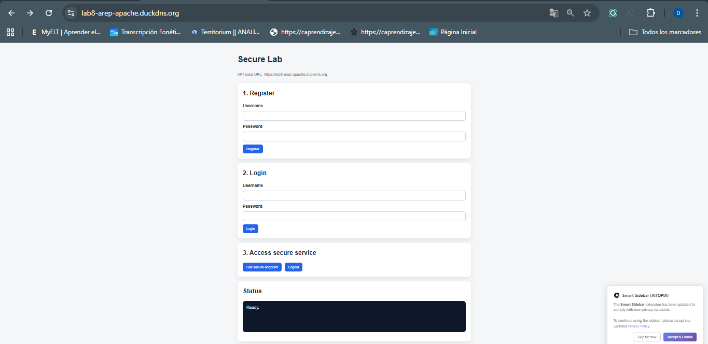
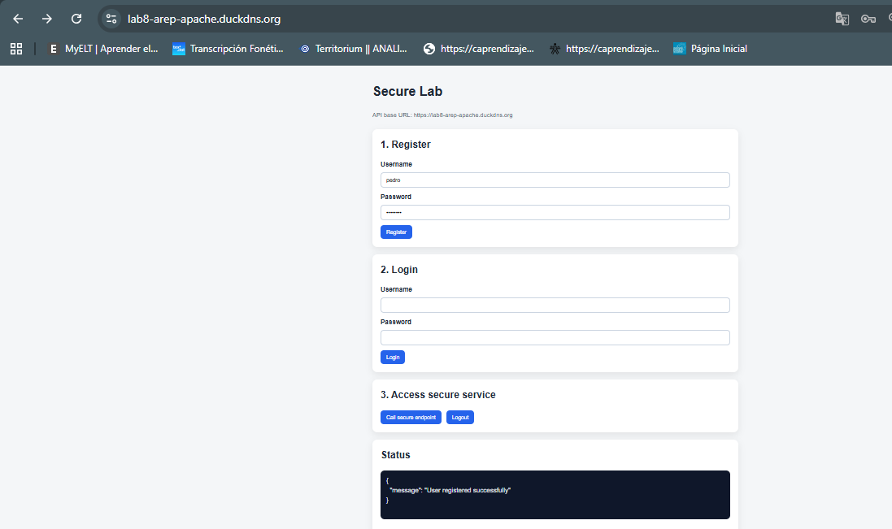
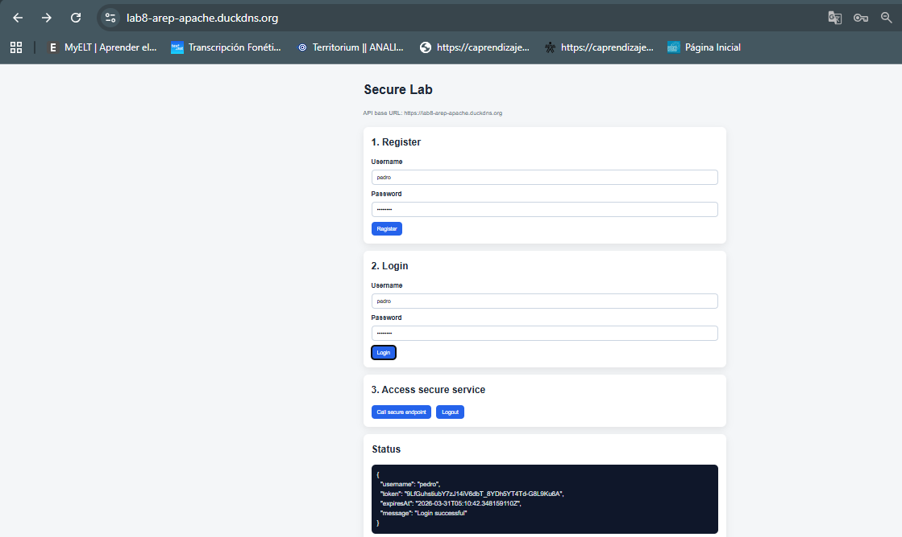
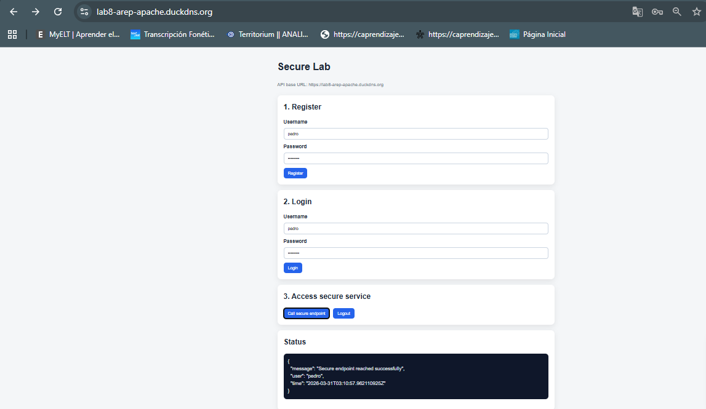
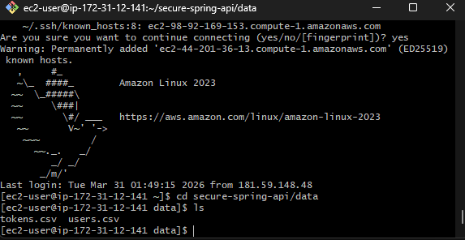
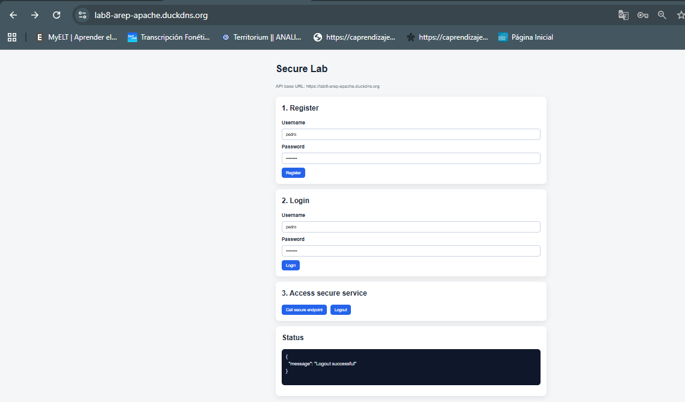

# Secure AWS Lab

This project is a secure web application built for the Enterprise Architecture Workshop: Secure Application Design. The application uses two servers deployed on AWS: one Apache server to deliver a static asynchronous HTML, CSS, and JavaScript client over HTTPS, and one Spring Boot server to expose secure REST services over HTTPS. The project includes user registration and login, password hashing with BCrypt, token-based authentication, CORS configuration, and TLS protection using local certificates for development and Let’s Encrypt certificates for deployment in AWS. The idea of this lab was to build something simple, understandable, and secure enough to demonstrate good architecture and security practices in a real cloud environment.

## Getting Started

These instructions will help you get a copy of the project running on your local machine for development and testing. At the end, there is also a deployment section with the steps used to publish the application on AWS using Apache, Spring Boot, TLS, and Let’s Encrypt.

## Prerequisites

Before running the project, make sure you have the following installed:

- Java 21
- Maven
- Python 3 or any simple local web server
- Git
- OpenSSL or keytool if you want to generate your own local certificate
- An AWS account for deployment
- Two EC2 instances with Amazon Linux 2023 for the live version
- Two public domains or subdomains if you want to use Let’s Encrypt in production

### Give examples

Check that Java and Maven are installed:

```bash
java -version
mvn -version
````

If you use the Maven Wrapper included in the project, you do not need Maven installed globally:

```bash
./mvnw -version
```

For AWS deployment, the project assumes a setup like this:

* `frontend.example.com` for Apache
* `api.example.com` for Spring Boot

You also need these ports open in the EC2 security groups:

* `22` for SSH
* `80` for Certbot validation
* `443` for HTTPS

## Installing

Below is the step by step process I followed to get the application working locally before deploying it to AWS.

### 1. Clone the repository

```bash
git clone https://github.com/daviidc29/lab8-Arep
cd secure-aws-lab
```

### 2. Review the project structure

The repository is divided into two main parts:

* `frontend-apache/` contains the static client
* `secure-spring-api/` contains the backend API
* `deploy/` contains example deployment files for Apache, environment variables, and systemd

### 3. Start the backend locally

Move into the backend folder:

```bash
cd secure-spring-api
```

This project already includes a local PKCS12 keystore for development, so you can run it directly with the local profile:

```bash
./mvnw spring-boot:run -Dspring-boot.run.profiles=local
```

If you are using Maven directly:

```bash
mvn spring-boot:run -Dspring-boot.run.profiles=local
```

The backend will start on:

```text
https://localhost:8443
```

### 4. Verify that the backend is alive

Open this URL in your browser or test it with curl:

```bash
curl -k https://localhost:8443/api/health
```

Expected response:

```json
{"message":"API is running"}
```

### 5. Configure the frontend

Open the frontend config file:

```bash
frontend-apache/config.js
```

Make sure it points to the local backend:

```javascript
window.APP_CONFIG = {
    apiBaseUrl: "https://localhost:8443"
};
```

### 6. Start the frontend locally

Move into the frontend folder:

```bash
cd ../frontend-apache
```

Run a simple local web server:

```bash
python -m http.server 8080
```

Then open:

```text
http://localhost:8080
```

### 7. Register a user

Use the Register form in the browser and create a user with:

* a valid username
* a password with at least 8 characters

When the registration is successful, the backend stores the username and the BCrypt password hash in `users.csv`.

### 8. Log in

Use the same username and password in the Login form. If the credentials are valid, the backend generates a token and the frontend stores it in session storage.

### 9. Access the protected endpoint

Click the button to call the secure endpoint. The frontend sends the Bearer token in the `Authorization` header and the backend checks it before returning the protected response.

### 10. Small demo of the system

You can also test the full flow manually with curl.

Register:

```bash
curl -k -X POST https://localhost:8443/api/auth/register \
  -H "Content-Type: application/json" \
  -d '{"username":"david","password":"SecurePass123"}'
```

Login:

```bash
curl -k -X POST https://localhost:8443/api/auth/login \
  -H "Content-Type: application/json" \
  -d '{"username":"david","password":"SecurePass123"}'
```

Use the returned token to access the secure service:

```bash
curl -k https://localhost:8443/api/secure/hello \
  -H "Authorization: Bearer YOUR_TOKEN_HERE"
```

That is the simplest end-to-end demo of the application working locally.

## Running the tests

At the moment, this project does not include a complete automated test suite with unit tests and integration tests. That means the validation for this lab was mainly done through build verification and manual end-to-end testing.

### Explain how to run the automated tests for this system

You can still run the default Maven test phase:

```bash
cd secure-spring-api
./mvnw test
```

Since no dedicated test classes were included in this version, this command mainly confirms that the project dependencies and build configuration are correct.

### Break down into end to end tests

The most important tests in this project are the manual end-to-end checks because they validate the actual lab requirements:

* the frontend is served correctly
* the backend answers through HTTPS
* user registration works
* passwords are not stored in plain text
* login returns a token
* the protected endpoint only works with a valid Bearer token

### Explain what these tests test and why

These checks matter because the objective of the lab is not only to compile the project, but to prove that the secure architecture works correctly across both servers and that the security controls are active.

### Give an example

A basic manual test flow is:

1. Open the frontend in the browser



2. Register a user



3. Log in



4. Call the secure endpoint



5. Verify that `users.csv` stores a BCrypt hash instead of the original password

6. Verify that `tokens.csv` contains the generated token



7. Log out and confirm the token is no longer valid



Video:

[](img/Secure%20Lab.mp4)


### And coding style tests

This repository does not currently include a separate linter or coding style validation tool such as Checkstyle, SpotBugs, or PMD.

### Explain what these tests test and why

In this version, code style was reviewed manually and the main focus was functional correctness, security behavior, and deployment.

### Give an example

A simple quality check used during development was rebuilding the backend after changes:

```bash
./mvnw clean package
```

This helps confirm that the code is still valid and the application can be packaged correctly.

## Deployment

This section summarizes how the application was deployed on a live AWS environment.

### 1. Frontend server on Apache

An EC2 instance was used to host the static frontend files with Apache HTTP Server.

Main steps:

```bash
sudo dnf update -y
sudo dnf install -y httpd
sudo systemctl enable httpd
sudo systemctl start httpd
```

The frontend files were copied to:

```text
/var/www/secure-frontend
```

Apache was configured with a VirtualHost similar to this:

```apache
<VirtualHost *:80>
    ServerName frontend.example.com
    DocumentRoot /var/www/secure-frontend

    <Directory /var/www/secure-frontend>
        Options Indexes FollowSymLinks
        AllowOverride None
        Require all granted
    </Directory>

    DirectoryIndex index.html
</VirtualHost>
```

Then TLS was enabled with Certbot and Let’s Encrypt:

```bash
sudo dnf install -y certbot python3-certbot-apache
sudo certbot --apache -d frontend.example.com
```

### 2. Backend server on Spring Boot

A second EC2 instance was used for the Spring Boot API.

Install Java and Maven:

```bash
sudo dnf update -y
sudo dnf install -y java-21-amazon-corretto-devel maven
```

Generate the Let’s Encrypt certificate for the backend:

```bash
sudo dnf install -y certbot
sudo certbot certonly --standalone -d api.example.com
```

Package the application:

```bash
cd secure-spring-api
mvn clean package -DskipTests
```

Copy the JAR and configure environment variables:

```bash
PORT=8443
SSL_CERTIFICATE=file:/etc/letsencrypt/live/api.example.com/fullchain.pem
SSL_PRIVATE_KEY=file:/etc/letsencrypt/live/api.example.com/privkey.pem
APP_DATA_DIR=/var/lib/secure-spring-api
ALLOWED_ORIGIN=https://frontend.example.com
TOKEN_TTL_MINUTES=120
```

Run the application as a service using systemd.

### 3. Backend and frontend communication

The frontend `config.js` was updated so the browser sends requests to the public HTTPS backend:

```javascript
window.APP_CONFIG = {
    apiBaseUrl: "https://api.example.com:8443"
};
```

### 4. What was demonstrated in the video

The video for this lab should show:

* the two EC2 instances
* the frontend running with HTTPS
* the backend running with HTTPS
* user registration
* user login
* the protected endpoint working with a valid token
* password hashes in `users.csv`
* generated tokens in `tokens.csv`
* a short explanation of the architecture and security decisions

## Built With

* Apache HTTP Server - Used to serve the static frontend
* Spring Boot 3 - Used to build the REST API
* Java 21 - Main programming language for the backend
* Maven - Dependency management and build tool
* HTML5 - Frontend structure
* CSS3 - Frontend styling
* JavaScript - Asynchronous client logic using `fetch`
* BCrypt - Password hashing
* AWS EC2 - Cloud infrastructure used for deployment
* Let’s Encrypt / Certbot - TLS certificate generation and installation

## Contributing

This project was developed mainly for academic purposes as part of a secure application design workshop. At the moment, there is no separate `CONTRIBUTING.md` file in the repository, but the project can still be improved through forks, pull requests, or team updates in future iterations.

## Versioning

This repository does not currently use tagged public releases, but a semantic versioning approach can be followed in future versions. The backend application is currently packaged with version `1.0.0`.

## Authors

David Santiago Castro


## License

At the moment, this repository does not include a dedicated license file. If the project will be shared outside the class context, adding a license such as MIT would be a good next step.

## Acknowledgments

* Escuela Colombiana de Ingeniería Julio Garavito for the academic context of the workshop
* AWS documentation for the EC2 and Apache deployment process
* Spring Boot documentation for secure backend configuration
* Let’s Encrypt and Certbot for TLS certificate management
* The workshop guide and tutorial materials used during the lab
* The course context, which focused on building a simple but secure architecture instead of an overly complex production system

